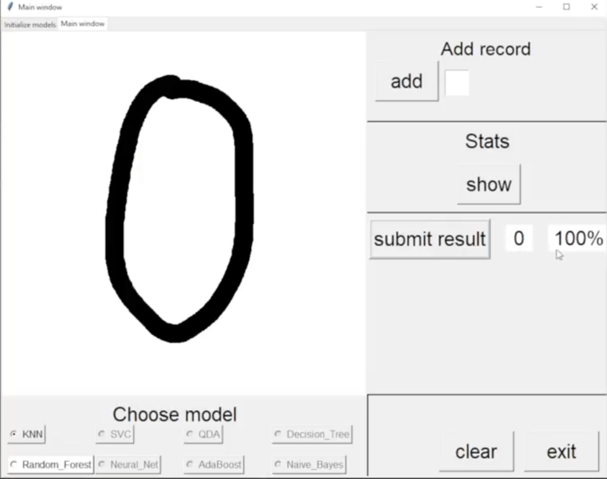

# Handwritten Digits Recognition (HDR)

## Python
It is my first bigger project in Python. I learned to code while creating it but I couldn't spend time regularly for it so it's not quit optimal. I have plans to continue it with more options to add and better optimalization  in the future.
## MNIST
While starting the project I found the __MNIST__ database and it saved my life.
## Sklearn
Sklearn was the library for machine learning part. I used most of __Sklearn clustering classifiers__ to handle the delivered data.
